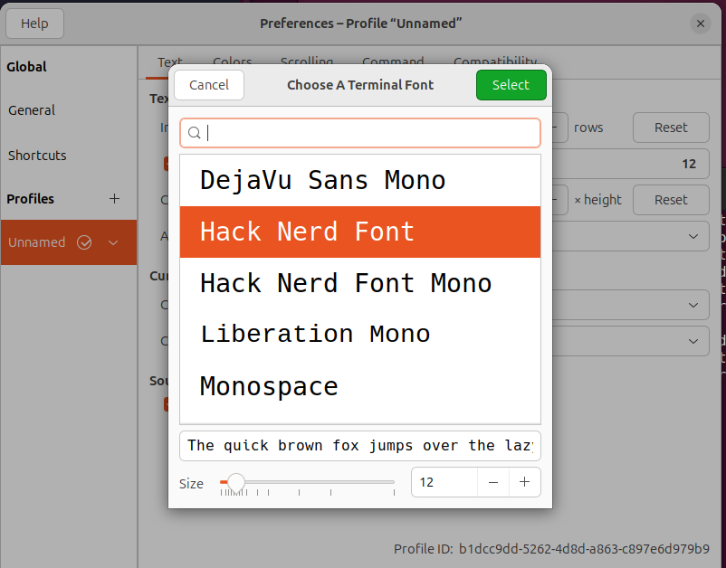

# Neovim personal configuration

##  Install dependency

### step 1
Use make file to add dependency

``` 
make add-dependency
source ~/.bashrc
nvm install node
npm install --global yarn
make add-node-provider
```

### step 2

Install Vivify to manage markdown display. [Vivify github link](https://github.com/jannis-baum/Vivify)

### step 3
Open terminal preference and use hack nerd font.




## Install nvim configuration

```
make install
```
